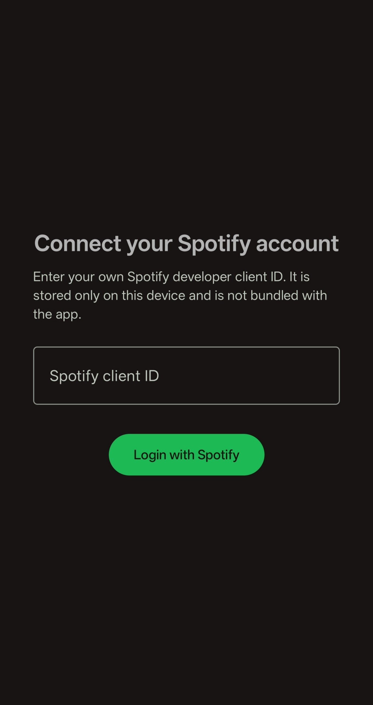
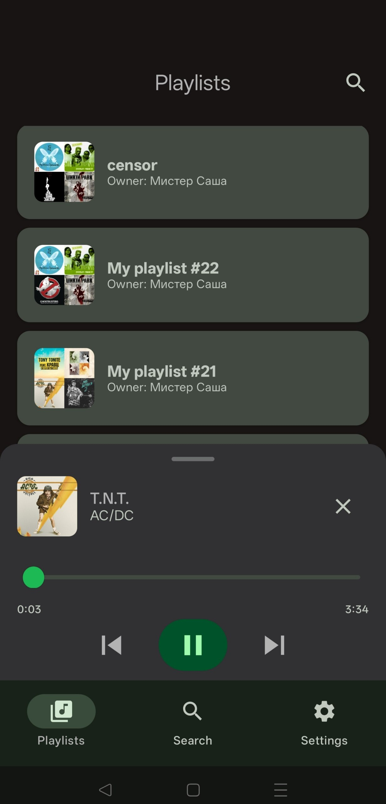
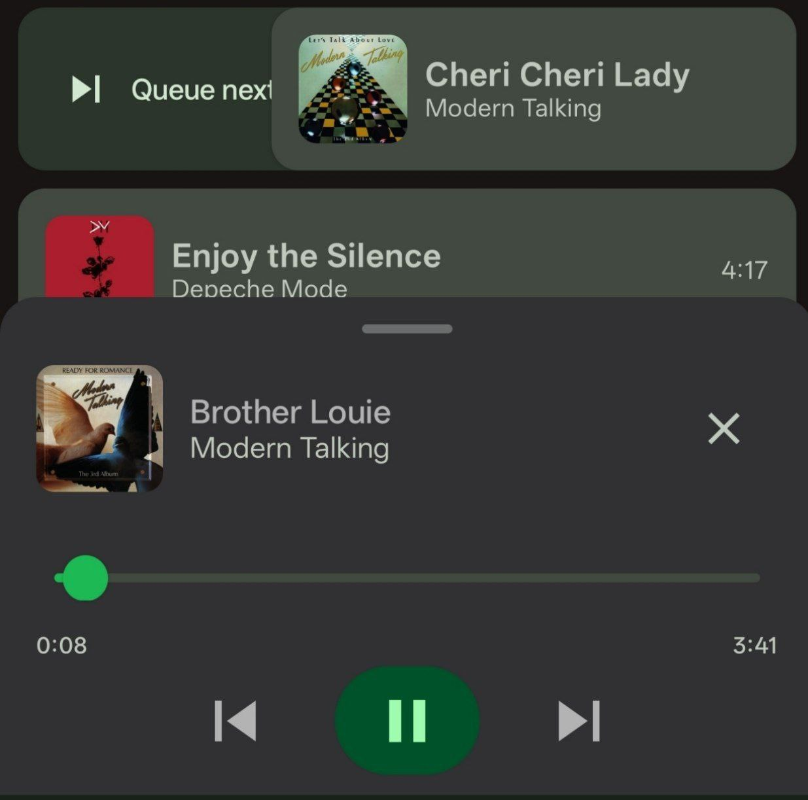
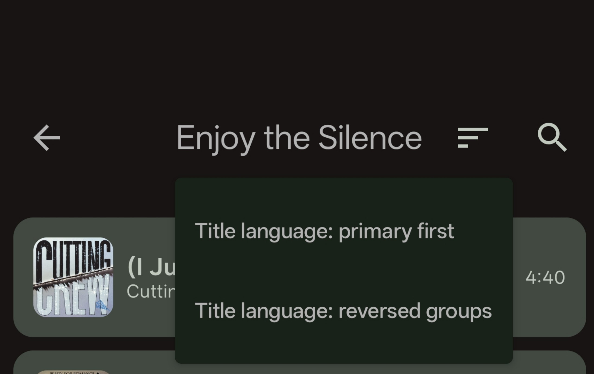

# Yousify

Yousify is an Android app for browsing Spotify playlists and playing matched audio through YouTube-based sources. Playlist data is synced from Spotify, stored locally, and used to drive queueing, search, filtering, and playback inside the app.

## Screenshots

### Login page


### Playlist list


### Mini player


### Available filters


## Features

- Spotify login with user-provided developer credentials
- Playlist sync from Spotify Web API
- Playlist cover artwork and square track artwork
- Playlist search
- Track search by title or artist inside a playlist
- Language-based track sorting inside a playlist
- Compact in-app player with seek support
- Queue that follows the currently filtered playlist order
- Swipe-right on a track to add it to the manual queue
- Local caching for Spotify-to-YouTube matching and resolved playback URLs

## Spotify Setup

This repository does not include Spotify credentials.

You must use your own Spotify developer app:

1. Open the Spotify Developer Dashboard: `https://developer.spotify.com/dashboard`
2. Sign in with your Spotify account.
3. Create a new app.
4. Open the app settings and copy your `Client ID`.
5. Add this Redirect URI:
   `http://127.0.0.1:8888/callback`
6. Save the app settings.
7. Launch Yousify.
8. After opening the app, enter your `Client ID` on the login screen.
9. Continue with Spotify login.

The app stores this value only on the local device by using Android encrypted preferences. It is not intended to be committed to the repository.

## Important Spotify Notes

- Yousify uses Spotify Authorization Code Flow with PKCE, so a `Client Secret` is not required in the app.
- Spotify developer apps start in Development Mode unless Spotify grants broader access.
- Development Mode apps are restricted to allowlisted/test users.
- If login works but playlist contents do not sync, first verify your app configuration in the Spotify dashboard.
- Yousify is implemented to work with Spotify's newer playlist items flow and keeps a compatibility fallback for older playlist endpoints.
- If you rotate or replace your Spotify app, you must enter the new credentials in the app again.

## How The App Works

- Spotify is used for authentication and playlist metadata.
- Playlist and track metadata are cached locally in the app database.
- Playback is resolved from YouTube-compatible sources at runtime.
- Resolved YouTube IDs and audio URLs are cached locally to reduce repeated lookups.
- The player queue respects the current filtered track list, while manually queued tracks are played first.

## Build

```bash
./gradlew assembleDebug
```


## Disclaimer

- This project is unofficial and is not affiliated with, endorsed by, or sponsored by Spotify or YouTube.
- Spotify, YouTube, and all related marks are the property of their respective owners.
- You are responsible for using your own developer credentials and complying with Spotify Developer Terms, Spotify Platform policies, YouTube Terms, and local copyright rules.
- This repository is provided for development and educational purposes. It is not legal advice.
